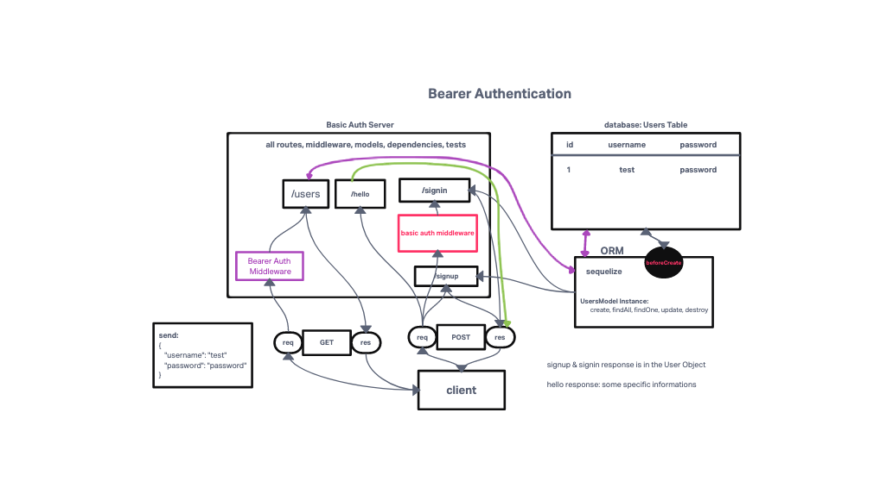

# LAB - Class 07

## Project: Bearer Authorization

### Author: KC Hofstetter

### Problem Domain

In this phase, the new requirement is that any user that has successfully logged in using basic authentication (username and password) is able to continuously authenticate … using a “token”. The following core requirements detail the functionality for this phase of the project.:

- Using an HTTP REST client or a web form:
  - Following a POST to /signup to create an account (or) Following a POST to /signin with basic authorization
    - Send a response to the client with the proper status code along with an object with the following properties
- Using an HTTP REST client, send a request to a “protected” route, such as /secretstuff
  - Your request must send an “Authorization” header, with the value of Bearer TOKEN
    - TOKEN is the token that you would have returned to the user after their signin step (above)
  - If the TOKEN is valid (i.e. if it represents an actual user)
    - The route should function as it normally would (sending a response)
  - If not
    - Send the user an error message stating “Invalid Login”
- Research ways to “secure” our JWT Tokens
- Implement one or more methods to secure our login tokens

### Links and Resources

- [ci/cd](https://github.com/khofstetter94/bearer-auth/pull/1)
- [back-end server url](https://kmh-bearer-auth.herokuapp.com/hello)

### Setup

- `PORT` - 3002

#### How to initialize/run your application (where applicable)

- npm start
- nodemon

#### Features / Routes

- POST: /signin
  - takes a username and password, encrypts the password, and then is entered into the database using the UserModel schema
- POST: /signup
  - Uses Bearer Auth to validate that the user exists in the database and has access to /users
- GET: /users
  - Validated users validated with bearer auth have access to this route
- GET: /hello
  - Taking a name from a query, uses Basic Auth to validate the user and returns a statement saying welcoming the guest

#### Tests

- POST to /signup to create a new user
- POST to /signin to login as a user
- Need tests for auth middleware and the routes
  - Does the middleware function
  - Do the routes assert the requirements (signup/signin)

#### UML

